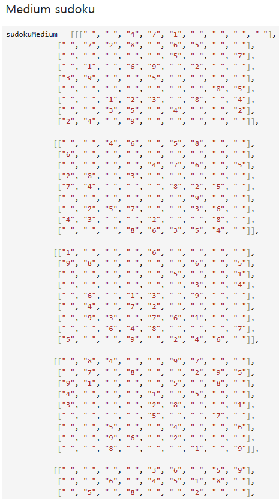

# project

### 스도쿠 게임을 하는 프로그램입니다.

#### 스도쿠는 가로 9칸, 세로 9칸으로 이루어진 9x9 보드에서 빈 칸을 정해진 규칙에 맞도록 채우는 게임입니다.

## 기능
### 1. 난이도 선택
#### Easy, Medium, Hard 중 선택할 수 있습니다.
### 2. 스도쿠 플레이
#### 스도쿠 문제가 주어지고 4가지 보기 중 선택하여 게임을 진행합니다.
#### - 숫자 입력(빈 칸의 숫자를 맞춥니다.)
#### - 힌트(빈 칸의 숫자가 무엇인지 알 수 있습니다.)
#### - 정답 공개(스도쿠의 정답을 공개합니다.)
#### - 게임 종료(프로그램을 종료합니다.)
### 3. 순위
#### play time에 걸린 시간을 기준으로 순위를 보여줍니다.
   

## 코드
#### 코드는 모듈, 함수, 데이터, 메인(프로그램)으로 크게 4가지로 나누어 작성하였습니다.

### 1. Modules
#### 프로그래밍에 필요한 모듈을 import합니다.

#### - random 모듈
####   스도쿠 문제를 생성할 때 사용합니다. (makeSudoku() 함수에 사용)

#### - copy 모듈
####   스도쿠 보드(List)를 복제할 때 사용합니다. (makeSudoku() 함수에 사용)

#### - time 모듈
####   스도쿠 풀이 순위를 내기 위해 사용합니다. (program(main)에서 사용)

### 2. Functions
#### main program에 필요한 함수를 작성하였습니다.

#### 2-1. 난이도 선택
#### 2-1-1. 난이도 입력 함수
#### 2-1-2. 난이도 선택 확인

#### 2-2. 스도쿠 문제
#### 2-2-1. 스도쿠 문제 생성
#### 2-2-2. 스도쿠 판 보여주기

#### 2-3. 스도쿠 플레이
#### 2-3-1. 보기 중 고르기
#### 2-3-2. 보기1

#### 2-3-3. 보기2
#### 2-3-4. 보기3
#### 2-3-5. 보기4

#### 2-4. 스도쿠 (시간) 랭킹
#### 2-4-1. 랭킹 목록 추가
#### 2-4-2. 순위 공개

#### 2-5. 프로그램 진행 여부

### 3. Data
#### 스도쿠 문제들(data)입니다.

#### 난이도 별로 문제(List)와 정답(List)을 가지고 있습니다.
#### Easy Data

#### Medium Data

#### Hard Data

#### data source: Guru Puzzle Game

### 4. Program(Main)
#### 프로그램의 main 부분입니다. 데이터와 만든 함수로 스도쿠 게임을 프로그래밍하였습니다.
#### (주석 참조)

   

## 실행 결과

### 난이도 선택
#### 프로그램을 실행하면 플레이할 난이도를 선택하게 합니다.

#### 잘못된 입력 시, 제대로된 입력이 있을 때까지 입력을 받습니다.

#### 제대로된 입력의 경우, 선택에 대해 다시 한번 확인합니다. 취소하는 경우 다시 플레이할 난이도를 물어보고 승락하는 경우 스도쿠 문제를 줍니다.

### 스도쿠 플레이
#### 스도쿠 문제에 대해 4가지 선택 보기를 줍니다. 잘못된 입력의 경우, 제대로된 입력이 있을 때까지 입력을 받습니다.

### 1번 보기
#### 1번을 선택한 경우, 숫자를 넣을 빈칸의 행과 열의 입력을 받습니다. 마찬가지로 잘못된 입력시 제대로된 입력이 있을 때까지 입력을 받습니다.

#### 입력받은 숫자가 정답이 아닌 경우, 틀렸다는 안내와 함께 다시 4가지 선택 보기를 고를 수 있도록 합니다.

#### 입력받은 숫자가 정답인 경우, 빈 칸을 그 숫자로 채우고 다시 4가지 선택 보기를 고를 수 있도록 합니다.

### 2번 보기
#### 2번을 선택한 경우, 알고싶은 빈 칸의 행과 열의 입력을 받습니다. 마찬가지로 잘못된 입력시 제대로된 입력이 있을 때까지 입력을 받습니다.

#### 입력된 칸의 숫자를 채우고 다시 4가지 선택 보기를 고를 수 있도록 합니다.

### 3번 보기
#### 3번을 선택한 경우, 정답 공개 여부를 확인 받습니다. 마찬가지로 잘못된 입력시, 제대로된 입력이 있을 때까지 입력받습니다.

#### 정답 공개를 승락한 경우, 스도쿠 문제의 정답이 공개되고 이 판은 랭킹에서 제외되어 순위를 알려주지 않습니다. 그리고 다음 게임 진행 여부를 물어봅니다. 마찬가지로 제대로된 입력이 있을 때까지 입력받습니다.

#### 게임 진행을 원하지 않는 경우, 프로그램은 종료됩니다.

#### 게임 진행을 원한 경우, 난이도 선택으로 돌아갑니다.

### 4번 보기
#### 4번을 선택한 경우, 게임 종료 여부를 다시 확인받습니다. 마찬가지로 잘못된 입력시, 제대로된 입력이 있을때까지 입력받습니다.

#### 프로그램 종료를 원하는 경우, 프로그램이 종료됩니다.

#### 프로그램 종료를 원하지 않는 경우, 진행하던 판으로 돌아가서 다시 4가지 선택 보기를 고를 수 있도록 합니다.

### 랭킹
#### 스도쿠 한 게임이 성공적으로 끝나면 순위를 알려주고 게임을 계속 진행할 것인지 입력받습니다. 마찬가지로 잘못된 입력에 대하여 제대로된 입력이 있을 때까지 입력받습니다.

#### 계속 진행하지 않는 경우, 프로그램은 종료됩니다.

#### 계속 진행을 원하는 경우, 난이도 선택으로 돌아가 위를 반복합니다.

### 잘못된 입력
#### 입력받는 모든 경우에 대하여 잘못된 입력 시, 제대로된 입력이 있을 때까지 입력받습니다.

