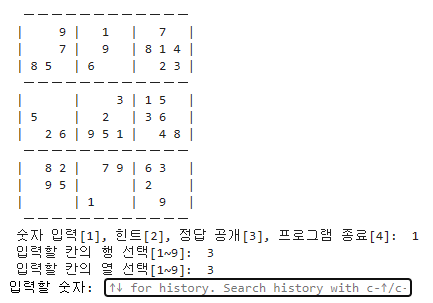
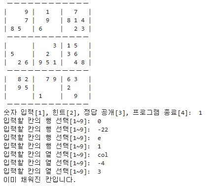

#  Project

Sudoku Program은 스도쿠 게임을 하는 프로그램입니다.

스도쿠란 가로 9칸, 세로 9칸으로 이루어진 9x9 보드에서 빈 칸을 정해진 규칙에 맞도록 채우는 게임입니다.

 

## $\bf{\color{#6580DD}목차}$

기능

코드

실행 결과

 

## $\bf{\color{#6580DD}기능}$
### 1. 난이도 선택

Easy, Medium, Hard 중 선택할 수 있습니다.

### 2. 스도쿠 플레이

스도쿠 문제가 주어지고 4가지 보기 중 선택하여 게임을 진행합니다.

 - 숫자 입력(빈 칸의 숫자를 맞춥니다.)

 - 힌트(빈 칸의 숫자가 무엇인지 알 수 있습니다.)

 - 정답 공개(스도쿠의 정답을 공개합니다.)

 - 게임 종료(프로그램을 종료합니다.)

   
### 3. 순위

play time에 걸린 시간을 기준으로 순위를 보여줍니다.

 

## $\bf{\color{#6580DD}코드}$
#### 코드는 모듈, 함수, 데이터, 메인(프로그램)으로 크게 4가지로 나누어 작성하였습니다.

 

### 1. Modules
#### 프로그래밍에 필요한 모듈을 import합니다.

 - random 모듈

   스도쿠 문제를 생성할 때 사용합니다. (makeSudoku() 함수에 사용)

 - copy 모듈

   스도쿠 보드(List)를 복제할 때 사용합니다. (makeSudoku() 함수에 사용)

 - time 모듈

   스도쿠 풀이 순위를 내기 위해 사용합니다. (program(main)에서 사용)

 

### 2. Functions
#### main program에 필요한 함수를 작성하였습니다.

#### (함수 주석과 docstring 참고)

 2-1. 난이도 선택

 2-1-1. 난이도 입력 함수

 2-1-2. 난이도 선택 확인

 2-2. 스도쿠 문제

 2-2-1. 스도쿠 문제 생성

 2-2-2. 스도쿠 판 보여주기

 2-3. 스도쿠 플레이

 2-3-1. 보기 중 고르기

 2-3-2. 보기1

 2-3-3. 보기2

 2-3-4. 보기3

 2-3-5. 보기4

 2-4. 스도쿠 (시간) 랭킹

 2-4-1. 랭킹 목록 추가

 2-4-2. 순위 공개

 2-5. 프로그램 진행 여부

 

### 3. Data
#### 스도쿠 문제들(data)입니다.

 난이도 별로 문제(List)와 정답(List)을 가지고 있습니다.

#### Easy Data

#### Medium Data

#### Hard Data

### Data source: Guru Puzzle Game
 

### 4. Program(Main)
#### 프로그램의 main 부분입니다. 데이터와 만든 함수로 스도쿠 게임을 프로그래밍하였습니다.
#### (주석 참조)

 

## $\bf{\color{#6580DD}실행 결과}$

### 난이도 선택

 프로그램을 실행하면 플레이할 난이도를 선택하게 합니다.

 난이도 선택에 대해 confirm. 확인받지 못한 경우 다시 난이도를 선택하게 하고, 확인받은 경우에는 스도쿠 문제를 제공합니다.

 

### 스도쿠 플레이

 스도쿠 문제에 대해 4가지 선택 보기를 주고 선택하도록 합니다.

 

### 1번 보기

 1번을 선택한 경우, 숫자를 넣을 빈칸의 행과 열 그리고 빈 칸에 넣을 숫자를 입력받습니다.

 입력받은 숫자가 정답인 경우, 빈 칸을 그 숫자로 채우고 다시 4가지 보기 중 고를 수 있도록 합니다.

입력받은 숫자가 정답이 아닌 경우, 틀렸다는 안내와 함께 다시 4가지 보기 중 고를 수 있도록 합니다.

 

### 2번 보기

 2번을 선택한 경우, 알고싶은 빈 칸의 행과 열의 입력을 받습니다. 입력된 칸의 숫자를 채우고 다시 4가지 보기 중 고를 수 있도록 합니다.

 

### 3번 보기

 3번을 선택한 경우, 선택에 대해 confirm.

 정답 공개를 확인받지 못한 경우, 진행하던 스도쿠 판으로 돌아가 4가지 보기 중 고를 수 있도록 합니다.

 정답 공개를 확인받은 경우, 스도쿠 문제의 정답이 공개됩니다. 이 판은 랭킹을 매기는데에서 제외되어 순위를 알려주지 않습니다. 그리고 다음 게임 진행 여부를 물어봅니다.

 게임 진행을 원하지 않는 경우, 프로그램은 종료됩니다.

 게임 진행을 원한 경우, 난이도 선택으로 돌아가 위를 반복합니다.

 

### 4번 보기

 4번을 선택한 경우, 게임 종료 선택 confirm.

 프로그램 종료를 원하지 않는 경우, 진행하던 판으로 돌아가서 4가지 보기 중 고를 수 있도록 합니다.

 프로그램 종료를 원하는 경우, 프로그램이 종료됩니다.

 

### 랭킹

 스도쿠 한 게임이 성공적으로 끝나면 그 판의 순위를 알려주고 게임을 계속 진행할 것인지 입력받습니다.

 진행을 원하지 않는 경우, 프로그램은 종료됩니다.

 진행을 원하는 경우, 난이도 선택으로 돌아가 위를 반복합니다.

 

### 잘못된 입력에 대한 처리

 입력받는 모든 경우에 대하여 잘못된 입력 시, 제대로된 입력이 있을 때까지 입력받습니다.

 난이도 선택 및 선택 confirm

 스도쿠 플레이 보기 선택

 스도쿠 플레이 1번 보기 중 행, 열, 숫자

 스도쿠 플레이 2번 보기 중 행, 열

 스도쿠 플레이 3번 보기 선택 confirm

 스도쿠 플레이 4번 보기 선택 confirm

 다음 스도쿠 진행 여부 선택

